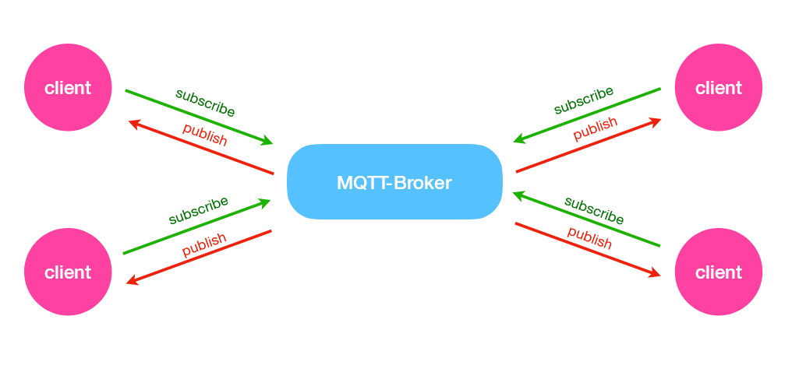
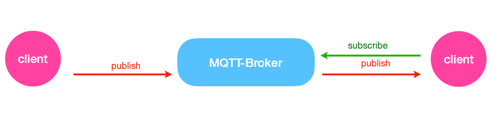
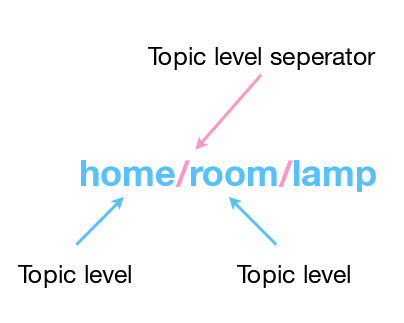
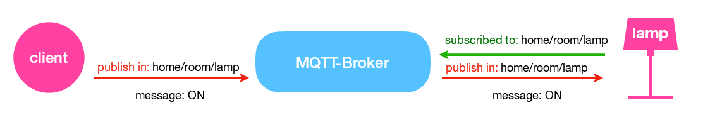
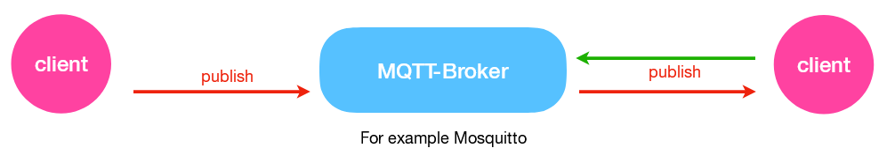

= WPF MQTT Client

== What is MQTT?

MQTT stands for: *MQ Telemetry Transport*. +
It is a publish and subscribe system. In other words, it is a simple communication between multiple devices. (Messaging protocol)

== What can you do with MQTT?

* Send a command to control an output
* Read and publish data

== Important Terms

=== Publish/Subscribe

*Example:*

1. Client on the left side publishes on a *_topic_*
2. Client on the right side subscribes on the *_same topic_*
3. Client on the right side receives the *_message_*

*Messages*: information exchanged between your clients (command or data)

=== Topics

* Interest for incoming messages
* Specify wehre you want to publish

Topics are represented with string separated by slashes. Slashes indicate the top level.

*Example:*

IMPORTANT: Topics are case-sensitive

=== Broker

* Receives all the messages
* Filters the messages
* Publishes the messages to all subscribed clients

